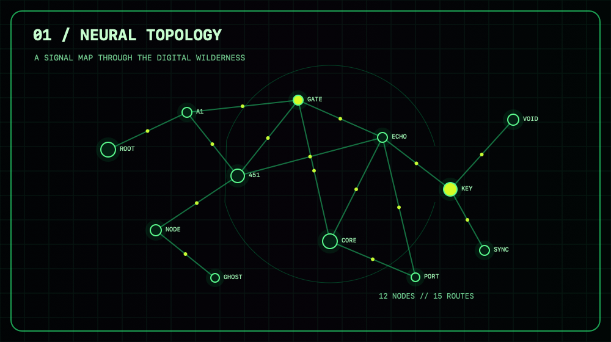
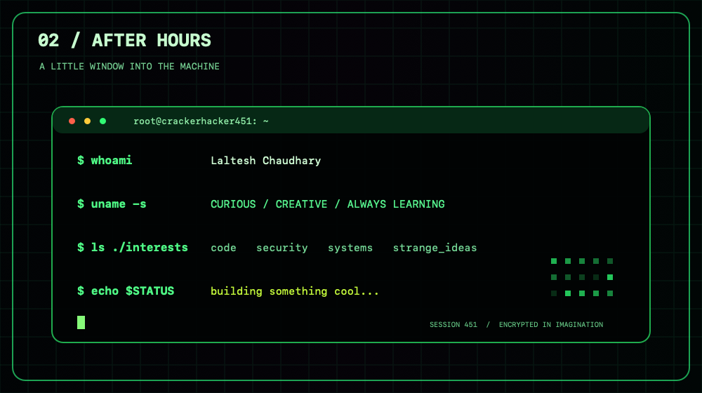
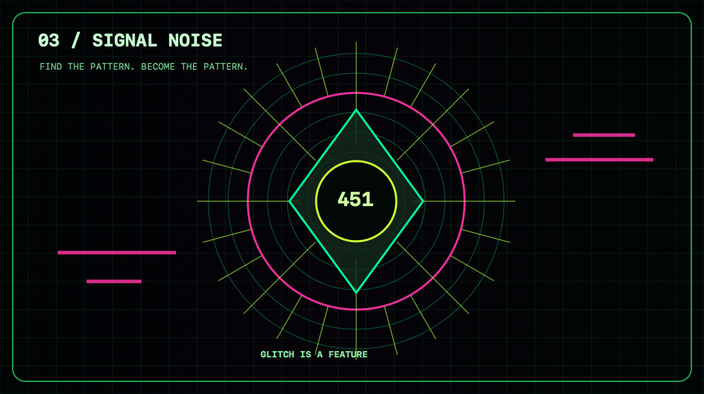

<p align="center">
  
</p>

# Hi, I'm Laltesh Chaudhary

Welcome to my GitHub profile!

Find me on GitHub: [@Crackerhacker451](https://github.com/Crackerhacker451)

This is where I share my projects and experiments. Feel free to explore my repositories.

## Signal Archive

Three original visuals from my neon terminal universe:

<p align="center">
  
  
</p>
<p align="center">
  
</p>

```text
root@crackerhacker451:~$ whoami
Laltesh Chaudhary
root@crackerhacker451:~$ ls interests/
code/  security/  systems/
```
